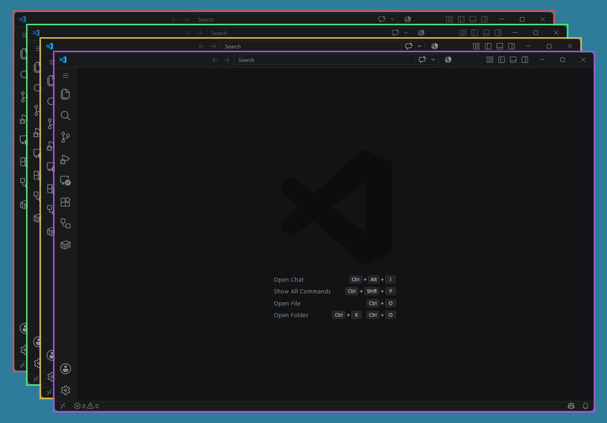
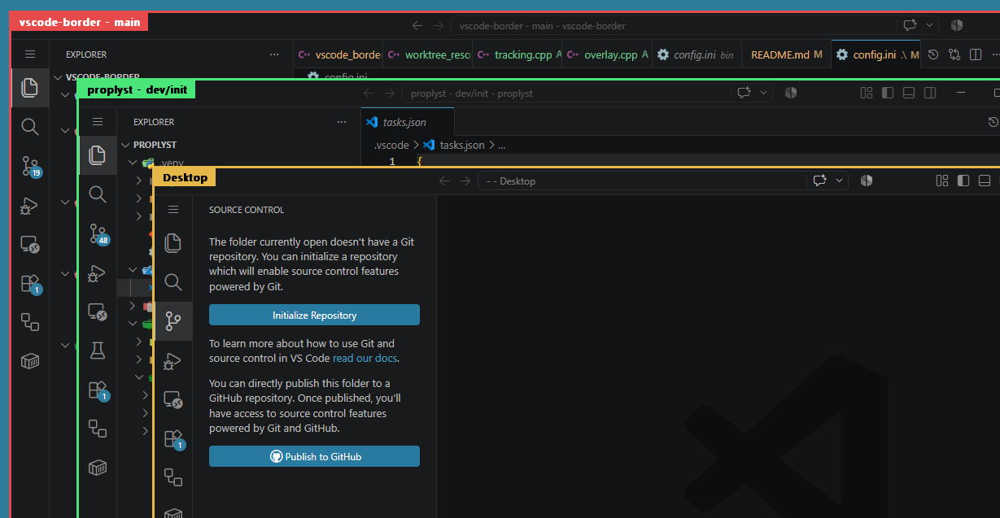

# vscode-border

Draws a colored border around every VS Code window so you can tell windows
apart at a glance. Each window gets its own color, assigned automatically.



## How it works

Each VS Code top-level window gets its own lightweight, click-through,
layered popup window painted as a hollow colored rectangle just outside the
target window's bounds. The overlay tracks its target's position, size,
Z-order, and visibility via `SetWinEventHook` (mainly
`EVENT_OBJECT_LOCATIONCHANGE`) -- no polling/redraw loop while idle. A slow
timer (`rescan_interval_ms` in `config.ini`) exists only as a safety net for
any missed event.

This means it works regardless of Windows theme/personalization settings,
and even when a window is maximized (the frame just gets clipped at whatever
screen edge the window is flush against).

For the non-obvious design decisions behind this (Z-order gotchas, why a
custom overlay instead of Windows' native border-color API, why there's
still a periodic rescan and what alternatives were considered), see
[docs/ARCHITECTURE.md](docs/ARCHITECTURE.md). For measured CPU/RAM/handle
numbers and the optimizations that came out of them, see
[docs/PERFORMANCE.md](docs/PERFORMANCE.md).

## Build

Requires the WinLibs MinGW-w64 g++ toolchain (installed via
`winget install BrechtSanders.WinLibs.POSIX.UCRT`).

```powershell
powershell -ExecutionPolicy Bypass -File build.ps1
```

Produces `bin\vscode_border.exe` (statically linked -- no MinGW runtime DLLs
needed) and copies the default `config.ini` into `bin\` if one isn't already
there.

## Run

```powershell
Start-Process bin\vscode_border.exe
```

It runs in the background with a tray icon (right-click for **Reload
Config** / **Open Config** / **Open Log Folder** / **Exit**). To launch it
automatically at login, see [docs/AUTOSTART.md](docs/AUTOSTART.md).

If something unexpected happens during a run (e.g. a VS Code window's
title doesn't match any recognized shape -- see [Getting the repo/branch
label](#getting-the-repobranch-label-instead-of-just-the-folder-name)), the
tray icon gets a small red asterisk badge and its tooltip changes to say
so. **Open Log Folder** jumps straight to `bin\vscode_border.log` (same
folder as `config.ini`; set `verbose_logging=true` in `config.ini` for full
per-event tracing on top of that). The log starts fresh on every launch,
so the badge only ever reflects the current run -- restarting the app is
what clears it.

## Configuration

Edit `bin\config.ini` (copied there from the template at the repo root on
first build):

| Key | Meaning |
|---|---|
| `thickness` | Border width in pixels, drawn just outside each window. |
| `opacity` | 0 (invisible) - 255 (fully opaque). |
| `rescan_interval_ms` | Safety-net rescan interval; new/closed windows are normally detected instantly. |
| `colors` | Comma-separated `RRGGBB` hex colors, assigned round-robin to windows. |
| `show_label` | Show the folder/repo name as a label chip inside the border's top-left corner (`true`/`false`). |
| `show_project_list` | Show an interactive project list HUD at the bottom-right of the desktop, using the same labels/colors and sorted by window left edge (`true`/`false`). |
| `project_list_opacity_normal` | Project list HUD opacity when no item is hovered: 0 (invisible) - 255 (fully opaque). |
| `project_list_opacity_hover` | Project list HUD opacity for the currently hovered item: 0 (invisible) - 255 (fully opaque). |
| `project_list_activate_on_hover` | Temporarily activate the matching VS Code window when hovering a project-list item (`true`/`false`, default `false`). |
| `label_height` | Label chip height in pixels. |
| `label_font_size` | Label text font size in points. |
| `label_text_color` | Label text color: a hex `RRGGBB` color, or `auto` to pick black/white based on contrast against the border color. Default `000000` (black). |

After editing, use the tray icon's **Reload Config** to apply changes
without restarting -- except for `colors`, which only takes effect on the
next launch (windows already tracked keep the color they were assigned).

### Getting the repo/branch label instead of just the folder name



The label is scraped from the VS Code window's title -- there's no other
way for an external app to ask VS Code what folder a window has open. By
default VS Code's title only contains the folder name, so to show the git
repo + branch instead, VS Code's `window.title` setting needs to be:

```json
"window.title": "${activeRepositoryName} - ${activeRepositoryBranchName} - ${folderName}"
```

**This is applied automatically -- no manual settings.json editing
needed.** Whenever `show_label=true` (the default), this app writes that
`window.title` value into VS Code's global `settings.json` for you (both
stable and Insiders, whichever are installed), the moment it starts or
Reload Config runs. If `window.title` already had some other value, the
original is remembered (in `window_title_state.ini` next to `config.ini`)
and restored automatically the next time you set `show_label=false` and
reload. If `window.title` wasn't set at all, it's removed again on
disable, leaving the file exactly as it was found.

If `window.title` already happened to have exactly that same value before
this app ever touched it (e.g. you'd set it manually per an older version
of this doc), it's left alone and not tracked for restoration -- turning
the label off later won't remove it. If you edit `window.title` yourself
while the label is on, that edit is respected: this app notices the value
no longer matches what it wrote and stops managing it rather than
overwriting your change.

With this set, the label shows `repo - branch` when the window is inside a
git repo, and falls back to just the folder name otherwise (e.g. a plain
folder with no `.git`, or an empty window). If you use git worktrees, VS
Code's `${activeRepositoryName}` shows the *worktree's* folder name rather
than the main repo's -- this app corrects that automatically as long as
your worktrees follow the `<mainRepo>.worktrees\<worktreeName>` layout, by
reading VS Code's own recently-opened-folder records. That mapping is
built once and cached in memory; use **Reload Config** from the tray icon
to pick up worktrees created after the app started.

## Known limitations

- Only tracks VS Code's own top-level windows (`Code.exe` / `Code -
  Insiders.exe`, main editor windows -- not floating panels/dialogs).
- If you have more open windows than colors in the palette, colors repeat.
- Border thickness/color is drawn by this app, not by Windows -- closing the
  app removes all borders immediately (nothing persists in the registry or
  window state).
- Deleting/uninstalling this app while `show_label=true` leaves the
  `window.title` edit it made in VS Code's `settings.json` in place --
  there's no uninstall hook to restore it. Set `show_label=false` and let
  it reload (or start it once more) before removing the app if you want
  that reverted first.

## Project layout

- `src/vscode_border.cpp` -- tray icon and app lifecycle (`wWinMain`).
- `src/logger.*` -- file logging.
- `src/config.*` -- `config.ini` loading.
- `src/window_title.*` -- VS Code window title parsing (repo/branch/folder).
- `src/worktree_resolver.*` -- maps a git worktree's folder name back to its main repo name.
- `src/vscode_settings.*` -- auto-manages VS Code's `window.title` setting to match `show_label` (see [Getting the repo/branch label](#getting-the-repobranch-label-instead-of-just-the-folder-name)).
- `src/window_discovery.*` -- finding/filtering VS Code top-level windows.
- `src/overlay.*` -- passive per-window border overlay creation/painting.
- `src/project_list_hud.*` -- interactive desktop project-list HUD rendering, hover focus, click, move, and resize behavior.
- `src/layered_rendering.*` -- shared alpha-blended text helpers for layered windows.
- `src/tracking.*` -- tracked-window bookkeeping, WinEvent hooks, border sync, and HUD data feed.
- `src/resource.rc`, `assets/app.ico`, `assets/square-dashed.png` -- tray icon resource (`app.ico` is generated from the PNG; see [Credits](#credits)).
- `config.ini` -- default config template (copied to `bin\` on first build).
- `build.ps1` -- build script.
- `install-autostart.ps1` / `uninstall-autostart.ps1` -- autostart management, see [docs/AUTOSTART.md](docs/AUTOSTART.md).
- [docs/ARCHITECTURE.md](docs/ARCHITECTURE.md) -- design decisions and why.
- [docs/PERFORMANCE.md](docs/PERFORMANCE.md) -- measured resource usage and optimizations.

## Credits

Tray icon: ["Square dashed" icon](https://www.flaticon.com/free-icon/square-dashed_17295663) from Flaticon.
